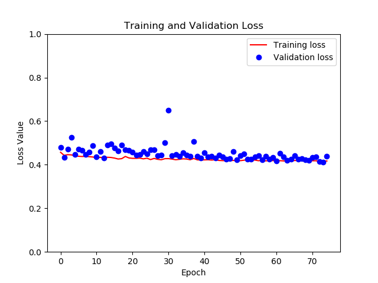

# MSNet

### Goal
The goal of this project was to implement the model from the paper titled "Automatic Brain Tumor Segmentation using Cascaded Anisotropic Convolutional Neural Networks." The authors of this paper implemented a model for the international BRaTs brain tumor segmentation competition that won 2nd place.

The authors provide code for their implementation in TensorFlow version 1; however, I decided to re-implement my own version of this using TensorFlow 2.2. I believe there is added benefit in this implementation, as it uses the more current version of TensorFlow and greatly simplifies some of the original code (which was very difficult to read, especially the data pre-processing steps).

The model is fully implemented and runs. However, I was not able to fully reproduce their results because of hardware limitations. The GPU memory needed to train this model appears to be very large, and as a result, I repeatedly ran into 'GPU out of memory' errors. I hope to find a way to get around this at some point.

The only way the model ran was by decreasing the input patch size significantly and reducing the batch size to at *most* 2. With this configuration, though, the model did not appear to learn very well, as shown by the training curve:

### Citations
- [1] Guotai Wang, Wenqi Li, Sebastien Ourselin, Tom Vercauteren. "Automatic Brain Tumor Segmentation using Cascaded Anisotropic Convolutional Neural Networks." In Brainlesion: Glioma, Multiple Sclerosis, Stroke and Traumatic Brain Injuries. Pages 179-190. Springer, 2018. https://arxiv.org/abs/1709.00382
- [2] Eli Gibson*, Wenqi Li*, Carole Sudre, Lucas Fidon, Dzhoshkun I. Shakir, Guotai Wang, Zach Eaton-Rosen, Robert Gray, Tom Doel, Yipeng Hu, Tom Whyntie, Parashkev Nachev, Marc Modat, Dean C. Barratt, Sébastien Ourselin, M. Jorge Cardoso^, Tom Vercauteren^. "NiftyNet: a deep-learning platform for medical imaging." Computer Methods and Programs in Biomedicine, 158 (2018): 113-122. https://arxiv.org/pdf/1709.03485
