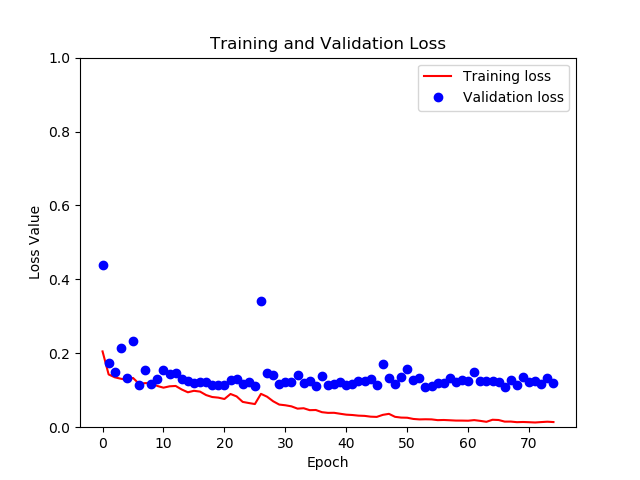

# MSNet

### Goal
The goal of this project was to implement the model from the paper titled "Automatic Brain Tumor Segmentation using Cascaded Anisotropic Convolutional Neural Networks." The authors of this paper implemented a model for the international BRaTs brain tumor segmentation competition that won 2nd place.

### About
The authors provide code for their implementation in TensorFlow version 1; however, I decided to re-implement my own version of this using TensorFlow 2.2. I believe there is added benefit in this implementation, as it uses the more current version of TensorFlow and greatly simplifies some of the original code (which was very difficult to read, especially the data pre-processing steps).

The model is fully implemented and runs. At first, I ran into hardware limitation issues with trying the original (19, 144, 144) image patch size that the authors use, so I resolved this by pre-processing the images to crop an ROI around the brain region and greatly reduce the size of the input images. This allowed me to successfully reduce the size of the input patches to (19, 98, 98). A batch size of 4 was as high as I could go given by GPU hardware limits and the heaviness of the model itself, but it seemed to cause no detriment (authors used a batch size of 5). Yet another aspect that may improve learning would be a `weight_map` that functions as a mask around the brain region such that the loss is only considered inside of the brain region (and not in the surrounding background).  

Below I show the training and validation progress. Clearly, the model begins to overfit towards the end (as we see validation loss and training loss diverge), so there is room for improvement here. But the validation loss nontheless is very low at that point, providing a dice score of about 0.90 for segmentations. Also, the training loss actually starts at around 0.70, and goes down from there rather quickly, but for some reason that does not show in the graph below. 

### Citations
- [1] Guotai Wang, Wenqi Li, Sebastien Ourselin, Tom Vercauteren. "Automatic Brain Tumor Segmentation using Cascaded Anisotropic Convolutional Neural Networks." In Brainlesion: Glioma, Multiple Sclerosis, Stroke and Traumatic Brain Injuries. Pages 179-190. Springer, 2018. https://arxiv.org/abs/1709.00382
- [2] Eli Gibson*, Wenqi Li*, Carole Sudre, Lucas Fidon, Dzhoshkun I. Shakir, Guotai Wang, Zach Eaton-Rosen, Robert Gray, Tom Doel, Yipeng Hu, Tom Whyntie, Parashkev Nachev, Marc Modat, Dean C. Barratt, Sébastien Ourselin, M. Jorge Cardoso^, Tom Vercauteren^. "NiftyNet: a deep-learning platform for medical imaging." Computer Methods and Programs in Biomedicine, 158 (2018): 113-122. https://arxiv.org/pdf/1709.03485
